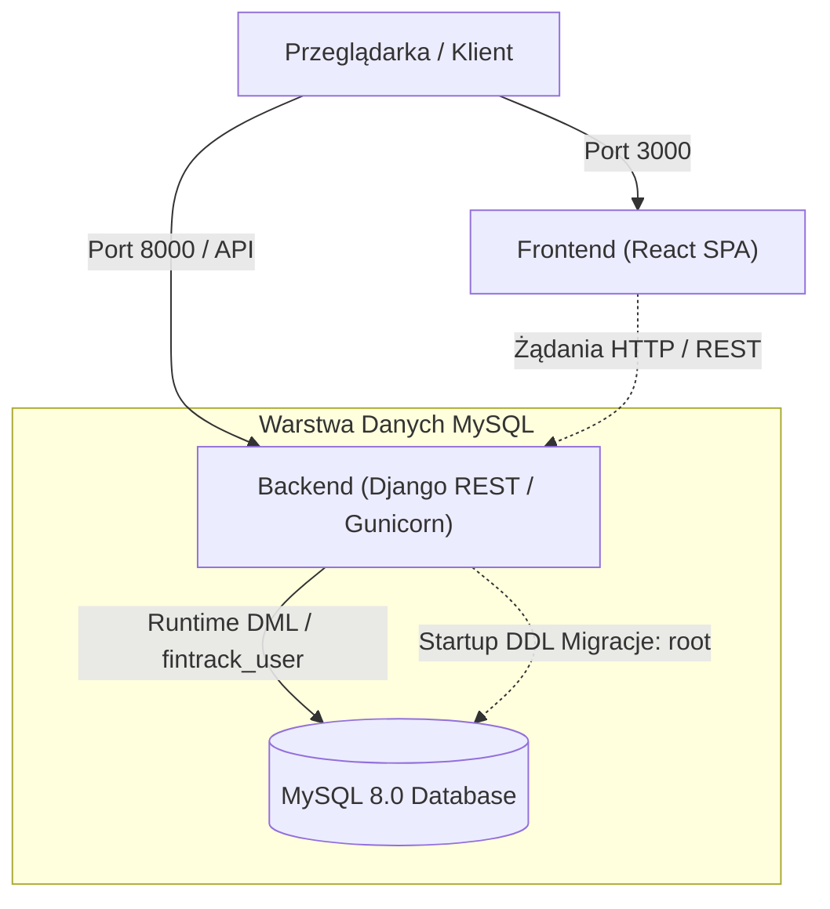

# OWASP Secure Web App – Hardened 3-Tier Architecture

Trójwarstwowa aplikacja webowa (React, Django REST, MySQL 8) zabezpieczona przed podatnościami OWASP Top 10 z izolacją bazy danych Table-Level Least Privilege w środowisku Docker.

---

## Spis treści
1. [Architektura rozwiązania](#1-architektura-rozwiązania)
2. [Główne komponenty](#2-główne-komponenty)
3. [Decyzje architektoniczne i bezpieczeństwo](#3-decyzje-architektoniczne-i-bezpieczeństwo)
4. [Struktura projektu](#4-struktura-projektu)
5. [Instrukcja uruchomienia](#5-instrukcja-uruchomienia)
6. [API Endpoints](#6-api-endpoints)

---

## 1. Architektura rozwiązania

Aplikacja wykorzystuje model trójwarstwowy z separacją interfejsu klienta (SPA), API biznesowego oraz bazy danych z twardym podziałem uprawnień na fazę DDL (migracje) i DML (działanie runtime):



### Przepływ orkiestracji (Docker Compose):
1. **`db` (MySQL 8.0)**:
   * Startuje silnik bazy danych i weryfikuje gotowość przez `healthcheck` (`mysqladmin ping`).
   * Skrypt `init-user.sh` tworzy bazę danych `fintrackbd` oraz nieuprzywilejowanego użytkownika aplikacji `fintrack_user` (bez praw DDL).
2. **`backend` (Django REST / Gunicorn)**:
   * Oczekuje na zdrowy stan bazy (`depends_on: db: condition: service_healthy`).
   * **Faza DDL (Root)**: Jako administrator `root` wykonuje migracje schematu (`migrate --no-input`) i wgrywa dane początkowe (`loaddata initial_data.json`).
   * **Security Lockdown**: Wykonuje skrypt `grant-privileges.sql`, nadając użytkownikowi `fintrack_user` minimalne uprawnienia wyłącznie do operacji DML (`SELECT, INSERT, UPDATE, DELETE`) na konkretnych tabelach.
   * **Faza Runtime (`fintrack_user`)**: Uruchamia serwer Gunicorn działający w kontekście ograniczonego użytkownika `fintrack_user`.
3. **`frontend` (React 19 SPA)**:
   * Startuje na porcie 3000 i komunikuje się z backendem z wykorzystaniem ciasteczek `HttpOnly` oraz nagłówków CSRF.

---

## 2. Główne komponenty

* **Frontend (`React 19 SPA`)**:
  * Routing oparty na `react-router-dom` z dynamicznym ładowaniem stron (`React.lazy` / `Suspense`).
  * Ochrona tras (`PrivateRoute`) weryfikująca sesję i uprawnienia (`ModeratorDashboard`).
  * Wizualizacja podsumowań wydatków, animacje i komponenty Material UI.
  * Komponent `ErrorBoundary` chroniący przed awarią aplikacji w przypadku błędów renderowania.

* **Backend (`Django 5.x / Django REST Framework`)**:
  * Autoryzacja hybrydowa: ciasteczka `HttpOnly` chronione przed XSS + obsługa standardowego nagłówka `Authorization: Bearer <token>` dla integracji zewnętrznych/API.
  * Ochrona przed CSRF na kluczowych endpointach mutujących stan.
  * Zaawansowany throttling (`ScopedRateThrottle`) zabezpieczający przed atakami brute-force.
  * Zabezpieczenie przed atakami DoS na procesy robocze (ograniczenie sleep backoff przy błędnych logowaniach).
  * Walidacja haseł (złożoność, znaki specjalne, weryfikacja słownikowa).
  * Obsługa aktywacji kont oraz procedury resetowania hasła przez tokeny czasowe.

* **Baza Danych (`MySQL 8.0`)**:
  * Kodowanie znaków `utf8mb4` z kolacją `utf8mb4_unicode_ci`.
  * Integracja ograniczeń integralności (`CheckConstraint`) na poziomie bazy danych.

---

## 3. Decyzje architektoniczne i bezpieczeństwo

### A. Table-Level Least Privilege bez over-engineeringu
* **Jak było:** Uprawnienia tabelaryczne były wcześniej nakładane przez osobny, redundantny kontener z obrazu MySQL (`granter`), który odpytywał bazę w nieskończonej pętli `while`, co zwiększało liczbę usług do 5 i generowało ryzyko race conditions.
* **Dlaczego zmieniono:** Chcieliśmy zachować rygorystyczny podział uprawnień (blokada poleceń DDL typu `DROP TABLE`, `ALTER TABLE` dla aplikacji), eliminując jednocześnie zbędne kontenery pomocnicze.
* **Co zrobiono:** Zintegrowano proces w fazie startowej backendu: administrator `root` wykonuje migracje schematu i natychmiast aplikuje `grant-privileges.sql`, a następnie serwer Gunicorn startuje z uprawnieniami ograniczonego użytkownika `fintrack_user`. Cały stos mieści się w 3 czystych usługach.

### B. Usunięcie błędów walidacji i import-time dat w modelach Django
* **Jak było:** 
  1. Pole `Category.name` posiadało `MinValueValidator(1)`, co przy walidacji ciągu znaków rzucało błąd typów Pythona (`TypeError: '<' not supported between instances of 'str' and 'int'`).
  2. Model `Expense` posiadał bazodanowy `CheckConstraint` z `timezone.now().date()`, co powodowało zapisanie statycznej daty wykonania migracji na stałe w pliku migracyjnym i blokowało wprowadzanie wydatków w kolejnych dniach.
* **Dlaczego zmieniono:** Modele muszą być stabilne i odporne na błędy wykonawcze bez generowania sztucznych migracji przy każdym uruchomieniu.
* **Co zrobiono:** 
  1. Zastąpiono `MinValueValidator` poprawnym `MinLengthValidator(1)` dla pól tekstowych.
  2. Usunięto statyczne ograniczenie daty z poziomu schematu bazy, pozostawiając dynamiczną walidację daty w metodzie `clean()` modelu oraz serializerze `ExpenseSerializer`.

### C. Zabezpieczenie przed DoS i optymalizacja widoków
* **Jak było:** Mechanizm spowalniania logowania (`linear back-off`) usypiał proces roboczy (`time.sleep(failures - 1)`) bez ograniczenia górnego limitu, co przy celowym floodzie pozwalało zablokować wszystkie wątki robocze Gunicorna (DoS).
* **Dlaczego zmieniono:** Mechanizm bezpieczeństwa nie może stawać się wektorem ataku blokującego działanie całej usługi.
* **Co zrobiono:** Ograniczono czas opóźnienia do maksymalnie 3 sekund (`min(failures - 1, 3)`), powierzając ochronę przed atakiem brute-force dedykowanemu mechanizmowi `ScopedRateThrottle`.

### D. Bezpieczeństwo sesji, HSTS i separacja środowisk
* **Jak było:** Nagłówki `SECURE_HSTS_SECONDS` oraz wymuszenie `SESSION_COOKIE_SECURE` były włączone bez względu na tryb deweloperski, co powodowało wymuszone przekierowania przeglądarek na HTTPS i uniemożliwiało testy lokalne po HTTP (`localhost`). Dodatkowo lista `ALLOWED_HOSTS` była pusta.
* **Dlaczego zmieniono:** Konfiguracja powinna automatycznie dostosowywać politykę bezpieczeństwa do środowiska (elastyczność deweloperska lokalnie vs. rygor produkcyjny).
* **Co zrobiono:** 
  1. Flagi `SECURE_HSTS_*` oraz ciasteczka `Secure` powiązano z warunkiem `if not DEBUG:` (włączane wyłącznie na produkcji przy HTTPS).
  2. Dodano parametryzację `ALLOWED_HOSTS`, `CORS_ALLOWED_ORIGINS` oraz `CSRF_TRUSTED_ORIGINS` przez zmienne środowiskowe z bezpiecznymi domyślnymi wartościami lokalnymi.

### E. Higiena repozytorium i ochrona sekretów
* **Jak było:** Plik `.env` zawierający klucz `SECRET_KEY` oraz hasła bazy danych był śledzony w repozytorium Git, a plik `.gitignore` był pusty (0 bajtów), przez co skompilowane pliki `__pycache__` trafiały do repozytorium.
* **Dlaczego zmieniono:** Ryzyko wycieku sekretów i zaśmiecanie historii repozytorium plikami binarnymi kompilatora Pythona.
* **Co zrobiono:** 
  1. Usunięto śledzenie pliku `backend/.env` z indeksu Gita i utworzono bezpieczne szablony `.env.example` oraz `backend/.env.example`.
  2. Skonfigurowano kompleksowy plik `.gitignore` obejmujący Pythona, Django, React, Node.js oraz pliki środowiskowe.
  3. Wyczyszczono wszystkie pliki `*.pyc` i katalogi cache.

---

## 4. Struktura projektu

```text
.
├── .env.example             # Szablon zmiennych środowiskowych dla Docker Compose
├── .gitignore                # Reguły ignorowania plików tymczasowych, cache i sekretów
├── README.md                 # Dokumentacja techniczna projektu
├── docker-compose.yml        # Orkiestracja 3 usług: db, backend, frontend
├── backend/
│   ├── .env.example          # Wzorzec konfiguracji zmiennych dla aplikacji Django
│   ├── Dockerfile            # Środowisko kontenerowe backendu
│   ├── manage.py             # Narzędzie CLI Django
│   ├── requirements.txt      # Zależności biblioteczne Pythona
│   ├── myproject/            # Główna konfiguracja projektu (settings, urls, wsgi, asgi)
│   └── api_app/              # Logika biznesowa API (wydatki, kategorie, autoryzacja)
│       ├── fixtures/         # initial_data.json (dane początkowe kategorii i użytkowników)
│       ├── migrations/       # Pliki migracji bazodanowych
│       ├── views/            # Widoki API (auth, expenses, summary, moderator)
│       ├── custom_auth.py    # Hybrydowe uwierzytelnianie JWT (HttpOnly Cookie + Bearer)
│       ├── models.py         # Modele Category oraz Expense
│       ├── permissions.py    # Niestandardowe uprawnienia (np. IsModerator)
│       ├── serializers.py    # Serializery REST (rejestracja, wydatki, moderator)
│       ├── signals.py        # Sygnały Django (wysyłka maili aktywacyjnych, seed grup)
│       └── validators.py     # Walidatory złożoności haseł
├── frontend/
│   ├── Dockerfile            # Środowisko uruchomieniowe frontendu React
│   ├── package.json          # Zależności NPM i skrypty
│   ├── public/               # Zasoby statyczne aplikacji SPA
│   └── src/
│       ├── api/              # Moduły komunikacji HTTP (apiBase, auth, expenses, summary)
│       ├── components/       # Komponenty wielokrotnego użytku (Loading, ErrorBoundary)
│       ├── pages/            # Widoki aplikacji (Dashboard, Login, Register, Moderator)
│       ├── App.js            # Routing i główny stan uwierzytelnienia
│       └── index.js          # Punkt wejścia aplikacji React
└── mysql/
    ├── init-user.sh          # Dynamiczny skrypt tworzący bazę i użytkownika fintrack_user
    └── grant-privileges.sql  # Skrypt nakładający Table-Level Least Privilege
```

---

## 5. Instrukcja uruchomienia

### Krok 1: Przygotowanie plików środowiskowych
Przed uruchomieniem skopiuj szablony konfiguracji:
```bash
# Konfiguracja główna
cp .env.example .env

# Konfiguracja backendu
cp backend/.env.example backend/.env
```

### Krok 2: Uruchomienie aplikacji
Uruchom stos technologiczny za pomocą Docker Compose:
```bash
docker compose up --build
```

### Krok 3: Dostęp do aplikacji
* **Aplikacja Frontend (React):** `http://localhost:3000`
* **Backend API (Django):** `http://localhost:8000/api`
* **Konta demonstracyjne (z fixtures):**
  * Zwykły użytkownik: `user1`
  * Moderator: `user3`

---

## 6. API Endpoints

| Metoda | Endpoint | Opis | Uprawnienia |
| :--- | :--- | :--- | :--- |
| `POST` | `/api/auth/token/` | Logowanie (zwraca tokeny i ustawia ciasteczka) | Publiczny |
| `POST` | `/api/auth/token/refresh/` | Odświeżenie sesji JWT | Publiczny / Cookie |
| `GET` | `/api/get-csrf-token/` | Pobranie tokenu ochrony CSRF | Publiczny |
| `POST` | `/api/register/` | Rejestracja nowego użytkownika | Publiczny |
| `POST` | `/api/activate/` | Aktywacja konta za pomocą tokenu | Publiczny |
| `POST` | `/api/logout/` | Wylogowanie i usunięcie ciasteczek | Zalogowany |
| `GET` | `/api/is-logged-in/` | Sprawdzenie stanu sesji i roli | Zalogowany |
| `GET` | `/api/categories/` | Pobranie listy kategorii wydatków | Zalogowany |
| `GET` / `POST` | `/api/expenses/` | Pobieranie i dodawanie wydatków | Zalogowany |
| `GET` / `PUT` / `DELETE`| `/api/expenses/<id>/` | Szczegóły, edycja i usuwanie wydatku | Właściciel wydatku |
| `GET` | `/api/expenses/summary/` | Miesięczne podsumowanie wydatków wg kategorii | Zalogowany |
| `GET` | `/api/moderator/users/` | Lista użytkowników systemu | Moderator |

